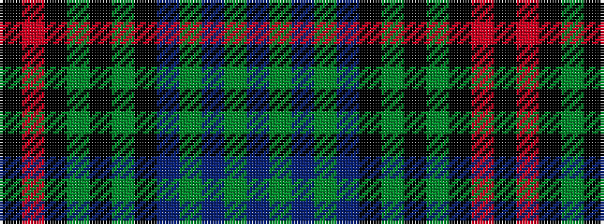

BGBGBKGKGKRK

It is a 12 stripe tartan.

<figure class="pat-woven">

<figcaption>idealised sample</figcaption>
</figure>

## Colour Sequence



## Tartans with this colour sequence

| Tartans |
|---------------|
| [Kells Irish Pubs (Corporate)](/variants/s12/k17o2k3g2k3g2k24b8g4b4g3b8~x2/)|
||
