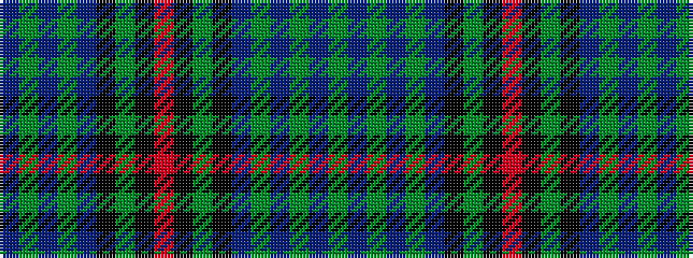

BGBGBKGKRKGKBGBGBG

It is a 18 stripe tartan.

<figure class="pat-woven">

<figcaption>idealised sample</figcaption>
</figure>

## Colour Sequence



## Tartans with this colour sequence

| Tartans |
|---------------|
| [Urbino](/setts/s18/dg3dp2dg2dp2dg2dp20k20dg22k1o3~x4/)|
||
