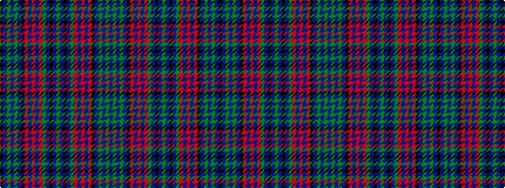

BGBGBKRBRBRGBKBGBKBGRBRBRKBGBGBK

It is a 32 stripe tartan.

<figure class="pat-woven">

<figcaption>idealised sample</figcaption>
</figure>

## Colour Sequence



## Tartans with this colour sequence

| Tartans |
|---------------|
| [Lumsden Green Clan Tartan](/variants/s32/dg34db2k2db2dg34r3db34r2db34r3k33db2dg2db2dg2db2k33~x2/)|
||
