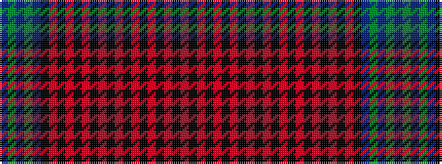

BGBGBKRKRKRKRKRKRKRKRKRKR

It is a 25 stripe tartan.

<figure class="pat-woven">

<figcaption>idealised sample</figcaption>
</figure>

## Colour Sequence



## Tartans with this colour sequence

| Tartans |
|---------------|
| [Isle of Arran (Lochcarron) (Fashion)](/variants/s25/dp40g2dp2g2dp2k7r1k2r2k2r2k1r3k2r3k1r2k2r2k2r1k7r10k2r4~x2/)|
||
