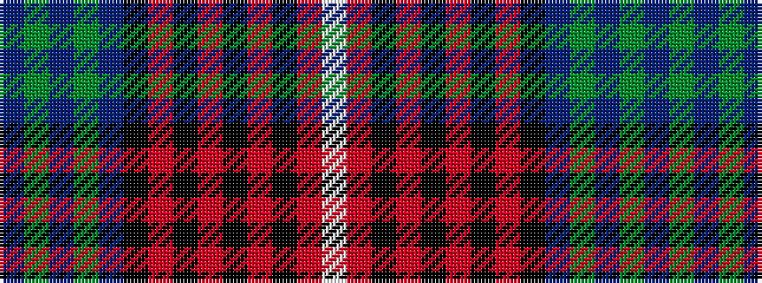

BGBGBKRKRKRKRW

It is a 14 stripe tartan.

<figure class="pat-woven">

<figcaption>idealised sample</figcaption>
</figure>

## Colour Sequence



## Tartans with this colour sequence

| Tartans |
|---------------|
| [Arran (Strathmore)](/variants/s14/dp60g4dp4g4dp4k14r2k5r3k3r4k2r5w3~x2/)|
||
