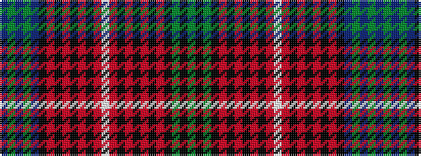

BGBGBKRKRKRKRWRKRKRKRKGKG

It is a 25 stripe tartan.

<figure class="pat-woven">

<figcaption>idealised sample</figcaption>
</figure>

## Colour Sequence



## Tartans with this colour sequence

| Tartans |
|---------------|
| [Arran](/setts/s25/p80g4p4g4p4k14r2k4r3k3r4k2r5w3r5k2r4k3r3k4r2k14y19k5y9~x2/)|
||
