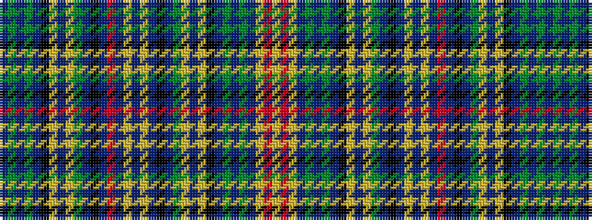

BGBGBKYBYGBKBRBYBYBKBGYBYKBGBGBYRY

It is a 34 stripe tartan.

<figure class="pat-woven">

<figcaption>idealised sample</figcaption>
</figure>

## Colour Sequence



## Tartans with this colour sequence

| Tartans |
|---------------|
| [Shipley, Ian (Personal)](/variants/s34/t3g13t5g3t5k9lg3t3lg3g6t3k3t16r3t3lg3t3ly3t16k3t3g6lg3t3lg3k9t5g3t5g13t3lg3r3lg3~x2/)|
||
