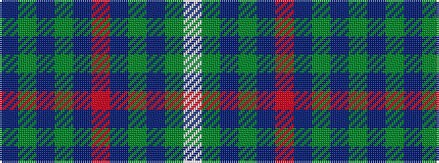

BGBGBRBGBGW

It is a 11 stripe tartan.

<figure class="pat-woven">

<figcaption>idealised sample</figcaption>
</figure>

## Colour Sequence



## Tartans with this colour sequence

| Tartans |
|---------------|
| [American Society of Travel Agents, The](/variants/s11/db2y18db2y2db20r3db18g2db2g18w2/)|
||
| [American Society of Travel Agents, The (2001)](/variants/s11/db4y32db4y4db32m6db32dg4db3dg32w4/)|
||
