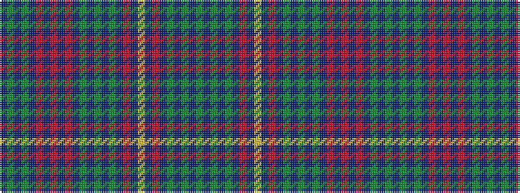

BGBGBRBRBRBGBGBGBRBYBRBGBGBG

It is a 28 stripe tartan.

<figure class="pat-woven">

<figcaption>idealised sample</figcaption>
</figure>

## Colour Sequence



## Tartans with this colour sequence

| Tartans |
|---------------|
| [Cairns of Finavon (Name)](/setts/s28/g16db3g3db3g3db16m15db1ly3db1m15db16g15db3g3db3g15db16m15b1m3b1m15db16g3db3g3db3~x2/)|
||
