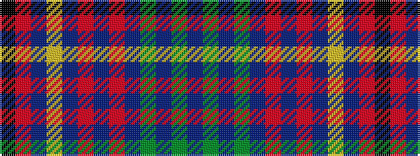

BGBGBRBRBYBRK

It is a 13 stripe tartan.

<figure class="pat-woven">

<figcaption>idealised sample</figcaption>
</figure>

## Colour Sequence



## Tartans with this colour sequence

| Tartans |
|---------------|
| [Merchant Company, The](/setts/s13/k1r1db14lo1db1r1db1r1db2dg6db1dg1db1~x4/)|
||
| [Merchant Company, The](/setts/s13/k1r1db14lo1db1r1db1r2db1dg6db1dg1db1~x4/)|
||
