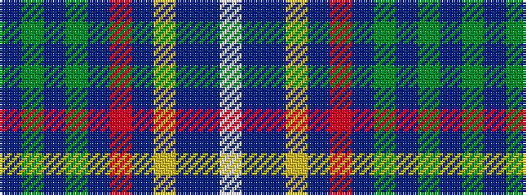

BGBGBRBYBBW

It is a 11 stripe tartan.

<figure class="pat-woven">

<figcaption>idealised sample</figcaption>
</figure>

## Colour Sequence



## Tartans with this colour sequence

| Tartans |
|---------------|
| [McCartney (Day)](/variants/s11/dp4dg2dp24dg8dt2r2dt2ly2dt10dp2w3~x2/)|
||
| [McCartney (Evening/Night)](/variants/s11/db4g2db24g8t2r2t2ly2t10db2w3~x2/)|
||
| [McCartney (Night)](/variants/s11/db4g2db24g8b2r2b2ly2b10db2w3~x2/)|
||
