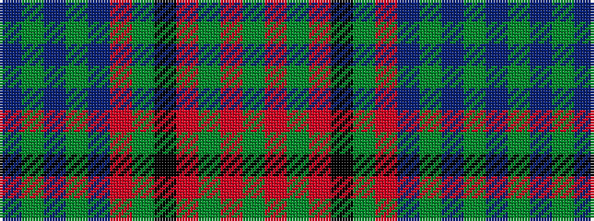

BGBGBRGKRGRG

It is a 12 stripe tartan.

<figure class="pat-woven">

<figcaption>idealised sample</figcaption>
</figure>

## Colour Sequence



## Tartans with this colour sequence

| Tartans |
|---------------|
| [Ridgeback (Corporate)](/variants/s12/g74o6g3o24k1g9o12db2g2db2g2db2~x2/)|
||
