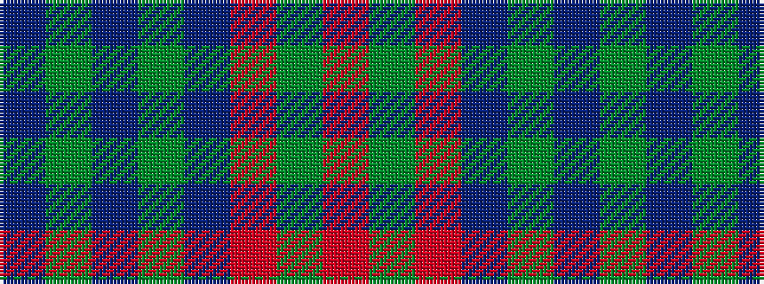

BGBGBRGR

It is a 8 stripe tartan.

<figure class="pat-woven">

<figcaption>idealised sample</figcaption>
</figure>

## Colour Sequence



## Tartans with this colour sequence

| Tartans |
|---------------|
| [Universal, Ancient](/setts/s8/t12g2t2g2t2o8g8o1~x2/)|
||
