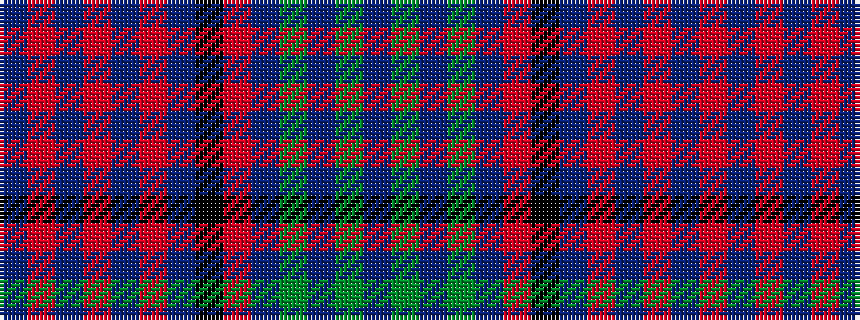

BGBGBRKBRBRBRB

It is a 14 stripe tartan.

<figure class="pat-woven">

<figcaption>idealised sample</figcaption>
</figure>

## Colour Sequence



## Tartans with this colour sequence

| Tartans |
|---------------|
| [Applestone](/variants/s14/b22r2b2r6b2r2b38k46r2do42y2do2y2do15~x2/)|
||
