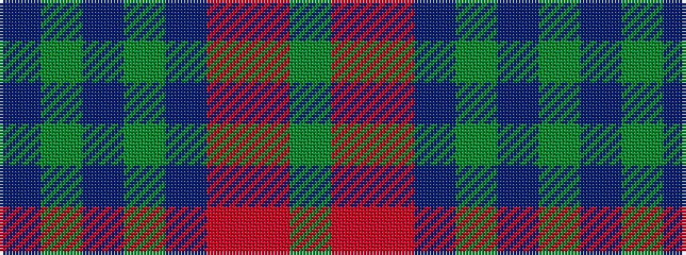

BGBGBRRG

It is a 8 stripe tartan.

<figure class="pat-woven">

<figcaption>idealised sample</figcaption>
</figure>

## Colour Sequence



## Tartans with this colour sequence

| Tartans |
|---------------|
| [Glen Erin](/setts/s8/db16g8db8g8db16r3o3g3~x2/)|
||
