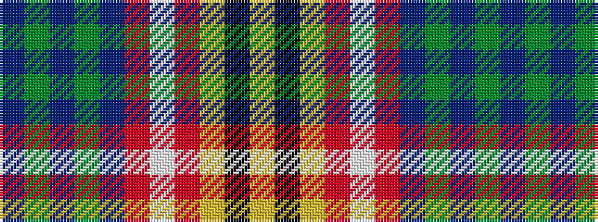

BGBGBRWRYKY

It is a 11 stripe tartan.

<figure class="pat-woven">

<figcaption>idealised sample</figcaption>
</figure>

## Colour Sequence



## Tartans with this colour sequence

| Tartans |
|---------------|
| [Buchanan #6](/setts/s11/ly30k2ly15r15w2r15db15dg15db4dg15db15~x2/)|
||
