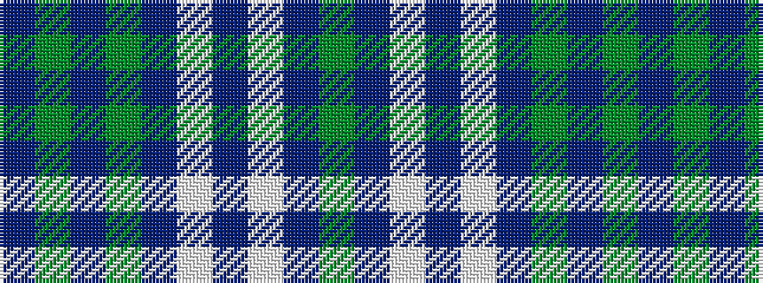

BGBGBWBWBG

It is a 10 stripe tartan.

<figure class="pat-woven">

<figcaption>idealised sample</figcaption>
</figure>

## Colour Sequence



## Tartans with this colour sequence

| Tartans |
|---------------|
| [Hickory](/setts/s10/db4yi30do2yi2do14w2do2w1do6y3~x2/)|
||
