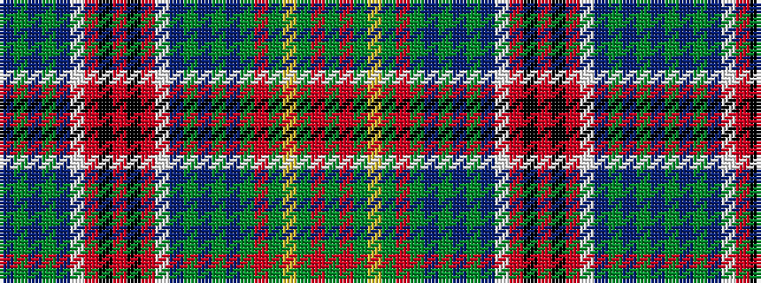

BGBGBWRKRKRWBGBGBGRGYGRG

It is a 24 stripe tartan.

<figure class="pat-woven">

<figcaption>idealised sample</figcaption>
</figure>

## Colour Sequence



## Tartans with this colour sequence

| Tartans |
|---------------|
| [O'Sullivan McCragh (Personal)](/setts/s24/y16r2y4lo2y4r2y16db2y3db2y3db10w2o12k2o5k2o12w2db10y3db2y3db2~x2/)|
||
