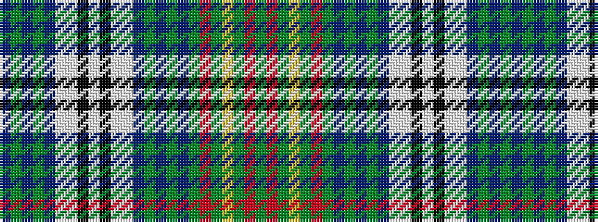

BGBGBWWKWKWWBGBGBGRGYGRG

It is a 24 stripe tartan.

<figure class="pat-woven">

<figcaption>idealised sample</figcaption>
</figure>

## Colour Sequence



## Tartans with this colour sequence

| Tartans |
|---------------|
| [O'Sullivan McCragh Family Tartan Tartan Number: 2169. Earliest known date: 1994 O'Sullivan McCragh was designed by Chris Aitken for Geoffrey (Tailor) Highland Crafts Ltd. in June 1994. See products available Copyright © Blair Urquhart, Comrie, 2015](/setts/s24/y16r2y4ly2y4r2y16db2y3db2y3db10w2lb12k2lb5k2lb12w2db10y3db2y3db2~x2/)|
||
