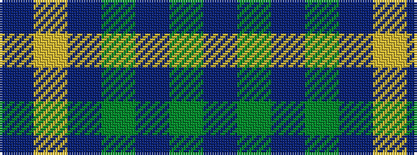

BGBGBYB

It is a 7 stripe tartan.

<figure class="pat-woven">

<figcaption>idealised sample</figcaption>
</figure>

## Colour Sequence



## Tartans with this colour sequence

| Tartans |
|---------------|
| [Crawford](/setts/s7/dr6lr2dr30dg12dr3dg12dr3~x2/)|
||
| [Crawford](/setts/s7/dr6lr2dr30dg12dr3dg12dr3/)|
||
