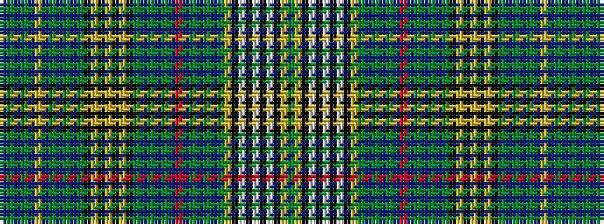

BGBGBYBGBGBGKYKYKYKGBGBGBRBGBGBGYKWKWKWKYG

It is a 42 stripe tartan.

<figure class="pat-woven">

<figcaption>idealised sample</figcaption>
</figure>

## Colour Sequence



## Tartans with this colour sequence

| Tartans |
|---------------|
| [Lodge Dunblane Australis No.966](/variants/s42/dg12ly1k2w2k2w2k2w2k2ly1dg12dp1dg2dp3dg1dp4r2dp4dg1dp3dg2dp1dg12k1lg4k1lg4k1lg4k1dg12dp1dg2dp3dg1dp4ly2dp4dg1dp3dg2dp1~x2/)|
||
