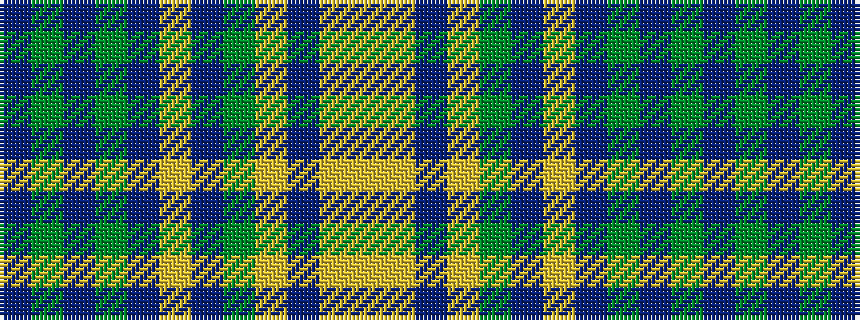

BGBGBYBGYBYY

It is a 12 stripe tartan.

<figure class="pat-woven">

<figcaption>idealised sample</figcaption>
</figure>

## Colour Sequence



## Tartans with this colour sequence

| Tartans |
|---------------|
| [Damson](/setts/s12/db48g4db6y2db2lr2db2g10lr6db2lr3lr2~x2/)|
||
