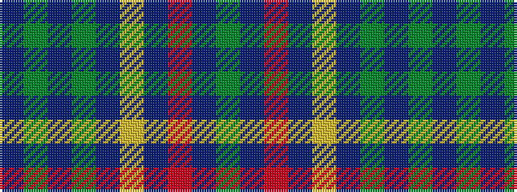

BGBGBYBRBG

It is a 10 stripe tartan.

<figure class="pat-woven">

<figcaption>idealised sample</figcaption>
</figure>

## Colour Sequence



## Tartans with this colour sequence

| Tartans |
|---------------|
| [Blue Ridge](/setts/g6t8o2t2ly2t16g18t4g4t3/)|
||
