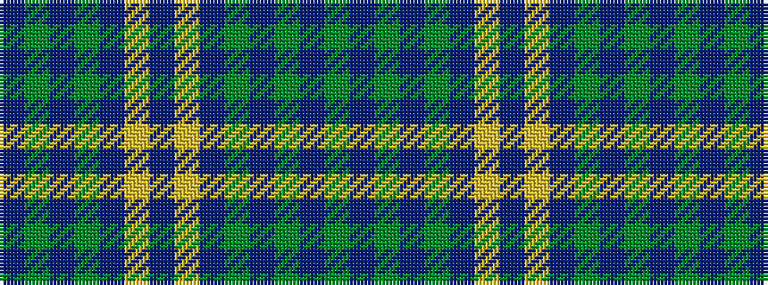

BGBGBYBYBGBGBG

It is a 14 stripe tartan.

<figure class="pat-woven">

<figcaption>idealised sample</figcaption>
</figure>

## Colour Sequence



## Tartans with this colour sequence

| Tartans |
|---------------|
| [Kinross](/setts/s14/dg20db2g6db2dg4db27lo2db8~x2/)|
||
