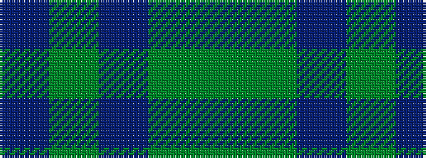

BGBGG

It is a 5 stripe tartan.

<figure class="pat-woven">

<figcaption>idealised sample</figcaption>
</figure>

## Colour Sequence



## Tartans with this colour sequence

| Tartans |
|---------------|
| [Bright of Garth (Personal)](/variants/s5/g7dy6dt7dy1dt2~x6/)|
||
| [Bright of Garth (Personal)](/variants/s5/g7y6n7y1n2~x6/)|
||
