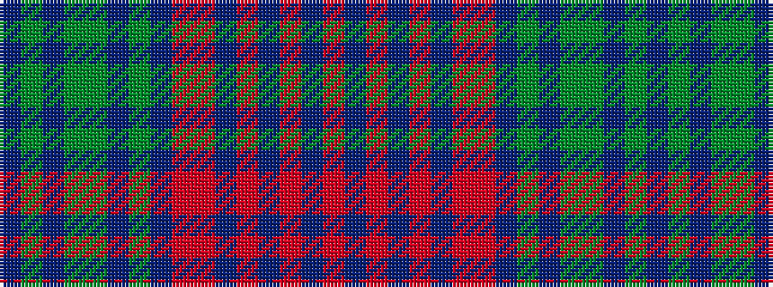

BGBGGBGBRRBRBRBR

It is a 16 stripe tartan.

<figure class="pat-woven">

<figcaption>idealised sample</figcaption>
</figure>

## Colour Sequence



## Tartans with this colour sequence

| Tartans |
|---------------|
| [Langerman (Anchorage)](/setts/s16/db1y2db1y3dg6db1y6db2r5r13do23r1do1r1do2r1~x2/)|
||
