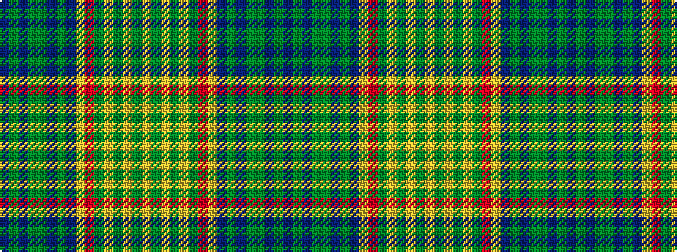

BGBGGBGBYRGYGYGY

It is a 16 stripe tartan.

<figure class="pat-woven">

<figcaption>idealised sample</figcaption>
</figure>

## Colour Sequence



## Tartans with this colour sequence

This pattern is a design lineage: every tartan below shares one colour order, whatever its owner —
near-identical designs are grouped, the largest lineage first (#112: the pattern is a tartan's
second parent, beside its family or clan).

<table class="sett-table">
<tbody>
<tr><td><a href="/variants/s16/db1g2db1g3dg6db1g6db2lo5r13dy23lo1dy1lo1dy2lo1~x2~g1903114-dg1806142/">Langermann (Name)</a></td></tr>
<tr><td class="sett-swatch"></td></tr>
</tbody>
</table>

