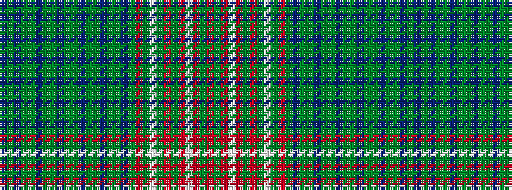

BGBGGBGGBGGBGGBGGBGRGWGRGRWRGR

It is a 30 stripe tartan.

<figure class="pat-woven">

<figcaption>idealised sample</figcaption>
</figure>

## Colour Sequence



## Tartans with this colour sequence

| Tartans |
|---------------|
| [Unidentified Victorian fancy](/variants/s30/db12g12db4dy20g12db4dy20g12db4dy20g12db4dy20g12db4dy20g12db11dy24ri4dy4w2dg20r8dy4r5w4r5dy4r8/)|
||
