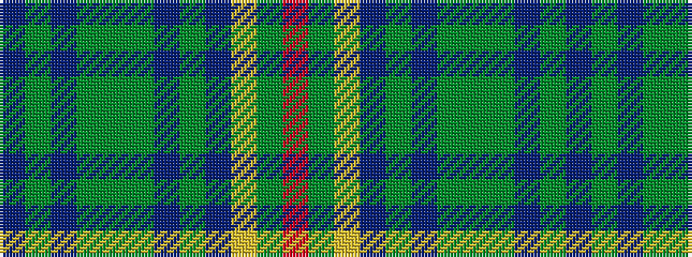

BGBGGGBGBYGR

It is a 12 stripe tartan.

<figure class="pat-woven">

<figcaption>idealised sample</figcaption>
</figure>

## Colour Sequence



## Tartans with this colour sequence

| Tartans |
|---------------|
| [Niagara Falls](/variants/s12/dt22g4dt4g17dy17g17dt4g4dt22ly8dy8r8~x2/)|
||
| [Niagra Falls Trade Tartan](/variants/s12/db22g4db4g17dy17g17db4g4db22ly8dy8r8~x2/)|
||
