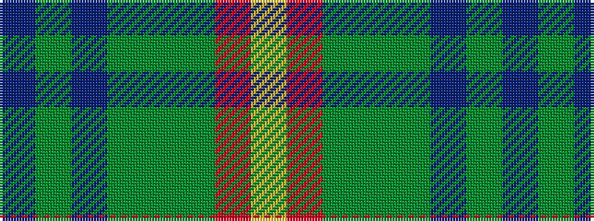

BGBGGGRY

It is a 8 stripe tartan.

<figure class="pat-woven">

<figcaption>idealised sample</figcaption>
</figure>

## Colour Sequence



## Tartans with this colour sequence

| Tartans |
|---------------|
| [Manitoba](/variants/s8/t6g2t2g41dg6g2r21ly6/)|
||
| [Manitoba](/variants/s8/t2g1t1g12dg2g1m6ly2~x4/)|
||
| [Manitoba District Tartan](/variants/s8/t2g1t1g12dg2g1r6ly2~x4/)|
||
| [Manitoba District Tartan](/variants/s8/ly622r21g2dg6g41t2g2t6/)|
||
