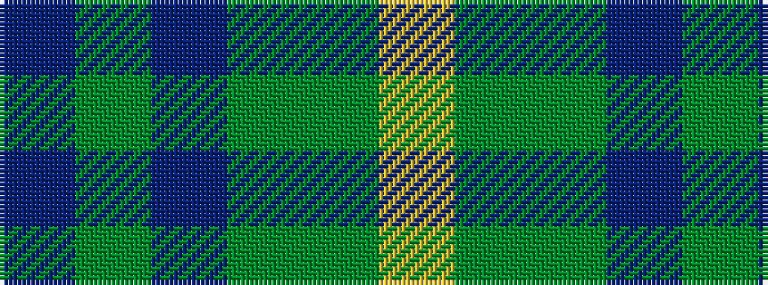

BGBGGY

It is a 6 stripe tartan.

<figure class="pat-woven">

<figcaption>idealised sample</figcaption>
</figure>

## Colour Sequence



## Tartans with this colour sequence

| Tartans |
|---------------|
| [Dewar (WCWM)](/setts/s6/dt1dy1dt7dy5y7lr1~x4/)|
||
