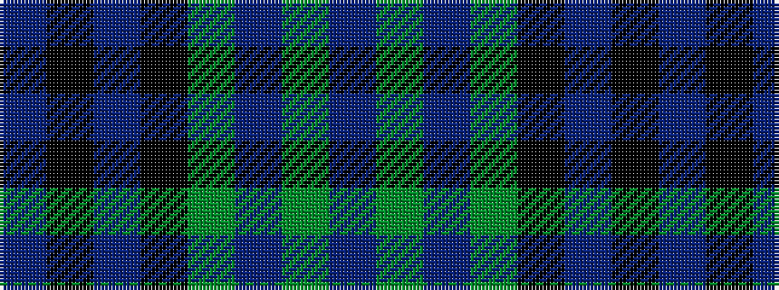

BGBGKBKB

It is a 8 stripe tartan.

<figure class="pat-woven">

<figcaption>idealised sample</figcaption>
</figure>

## Colour Sequence



## Tartans with this colour sequence

| Tartans |
|---------------|
| [Baird](/setts/s8/db3k2db8k8dg8dp1dg1dp3~x2/)|
||
| [Baird](/setts/s8/db3k2db8k8g8p1g1p3~x2/)|
||
| [Baird](/setts/s8/db3k2db8k8dg8n1dg1n3~x2/)|
||
| [Baird (Modern)](/setts/s8/db3k2db8k8g8dp1g1dp3~x4/)|
||
| [Baird Clan Tartan Tartan Number: 104. Earliest known date: 1906 This tartan is first recorded in Johnston's work of 1906, and the sample from the Highland Society of London probably dates from the same period. In both these early references the triple stripes are rendered in red. Today, however, they are generally woven in purple. The name originates from 'bard' meaning poet. The Bairds owned estates in Aberdeenshire which were later purchased by the Gordons. See products available Copyright © Blair Urquhart, Comrie, 2015](/setts/s8/db3k2db8k8g8dp1g1dp3~x2/)|
|![Baird Clan Tartan Tartan Number: 104. Earliest known date: 1906 This tartan is first recorded in Johnston's work of 1906, and the sample from the Highland Society of London probably dates from the same period. In both these early references the triple stripes are rendered in red. Today, however, they are generally woven in purple. The name originates from 'bard' meaning poet. The Bairds owned estates in Aberdeenshire which were later purchased by the Gordons. See products available Copyright © Blair Urquhart, Comrie, 2015 example sett](/setts/s8/db3k2db8k8g8dp1g1dp3~x2/sett.png)|
