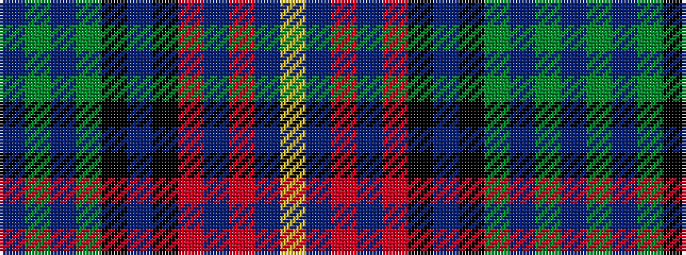

BGBGKBKRBRBY

It is a 12 stripe tartan.

<figure class="pat-woven">

<figcaption>idealised sample</figcaption>
</figure>

## Colour Sequence



## Tartans with this colour sequence

| Tartans |
|---------------|
| [Kinloch Anderson Castle Grey](/setts/s12/do8y8do4y28k12dt6k12r4dt8r4dt29lr6/)|
||
