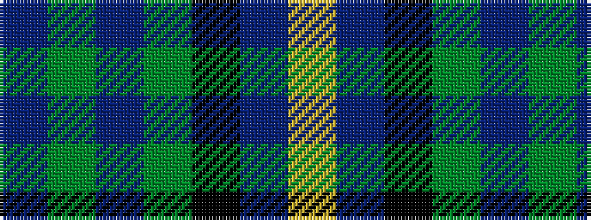

BGBGKBY

It is a 7 stripe tartan.

<figure class="pat-woven">

<figcaption>idealised sample</figcaption>
</figure>

## Colour Sequence



## Tartans with this colour sequence

| Tartans |
|---------------|
| [MacKay](/variants/s7/db8dg8db1dg8k8db8ly2~x2/)|
||
| [MacKay](/variants/s7/db8g8db1g8k8db8ly2~x2/)|
||
