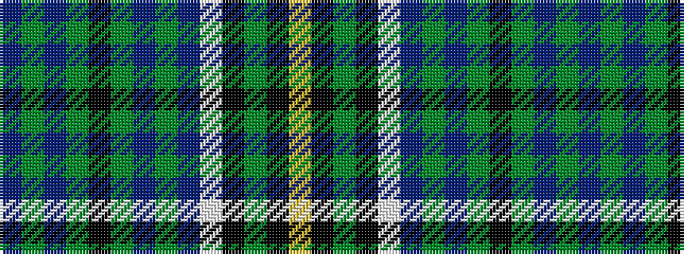

BGBGKGBGBWKGKY

It is a 14 stripe tartan.

<figure class="pat-woven">

<figcaption>idealised sample</figcaption>
</figure>

## Colour Sequence



## Tartans with this colour sequence

| Tartans |
|---------------|
| [MacAlpine](/setts/s14/dt4g1dt1g6k1g6dt1g1dt4w1k4g1k4ly2~x4/)|
||
| [MacAlpine (1906)](/setts/s14/db4g1db1g6k1g6db1g1db4w1k4g1k4ly1~x4/)|
||
