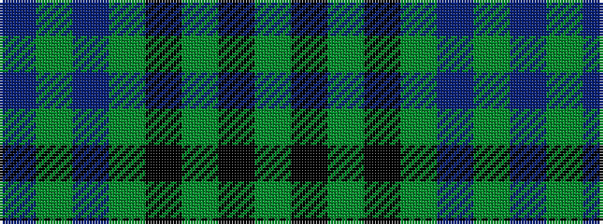

BGBGKGKG

It is a 8 stripe tartan.

<figure class="pat-woven">

<figcaption>idealised sample</figcaption>
</figure>

## Colour Sequence



## Tartans with this colour sequence

| Tartans |
|---------------|
| [Holmes (Clan?)](/variants/s8/g30k3g3k3g6b32g3b3~x2/)|
||
