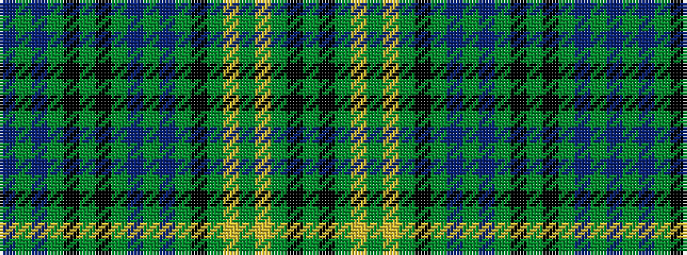

BGBGKGKGBGBGKGYGYGKG

It is a 20 stripe tartan.

<figure class="pat-woven">

<figcaption>idealised sample</figcaption>
</figure>

## Colour Sequence



## Tartans with this colour sequence

| Tartans |
|---------------|
| [Washington, Stockman](/setts/s20/db4y3db4y19k2y3k2y12db4y3db4y3k1y2ly1y2ly1y2k1y3~x4/)|
||
