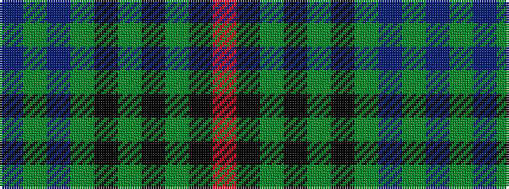

BGBGKGKGKR

It is a 10 stripe tartan.

<figure class="pat-woven">

<figcaption>idealised sample</figcaption>
</figure>

## Colour Sequence



## Tartans with this colour sequence

| Tartans |
|---------------|
| [Dunedin Chapter](/setts/s10/db32dg2db2dg14k2dg14k2dg2k15r2~x2/)|
||
| [Dunedin Chapter (Corporate)](/setts/s10/t39g3t3g20k3g20k3g3k20r3~x2/)|
||
