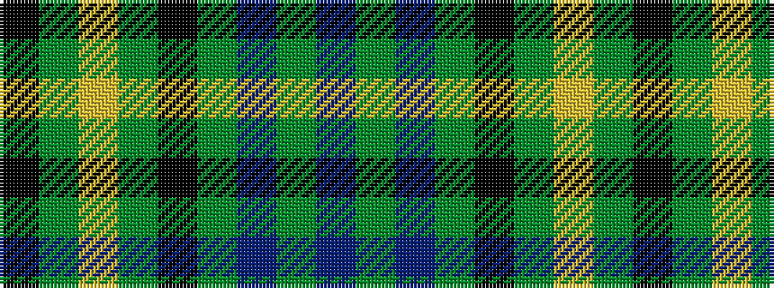

BGBGKGYGK

It is a 9 stripe tartan.

<figure class="pat-woven">

<figcaption>idealised sample</figcaption>
</figure>

## Colour Sequence



## Tartans with this colour sequence

| Tartans |
|---------------|
| [Oliver Hunting - 1973 (Clan)](/setts/s9/t62g5t3g22k3g3ly3g3k6~x2/)|
||
| [Oliver, hunting](/setts/s9/db40g3db2g12k2g2ly2g2k3~x2/)|
||
