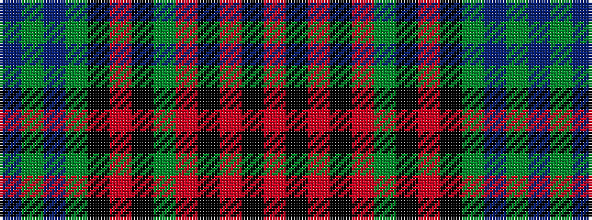

BGBGKRKGRKRKR

It is a 13 stripe tartan.

<figure class="pat-woven">

<figcaption>idealised sample</figcaption>
</figure>

## Colour Sequence



## Tartans with this colour sequence

| Tartans |
|---------------|
| [Forbes (Pendleton-1)](/variants/s13/db6dg1db8dg8k8r1k8dg8r6k6r14k1r6~x4/)|
||
