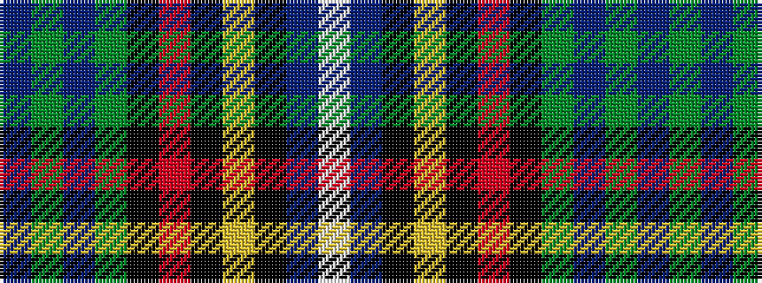

BGBGKRKYKBW

It is a 11 stripe tartan.

<figure class="pat-woven">

<figcaption>idealised sample</figcaption>
</figure>

## Colour Sequence



## Tartans with this colour sequence

| Tartans |
|---------------|
| [McCartney (Day)](/setts/s11/p4dg2p24dg8k2r2k2ly2k10p2w3~x2/)|
||
