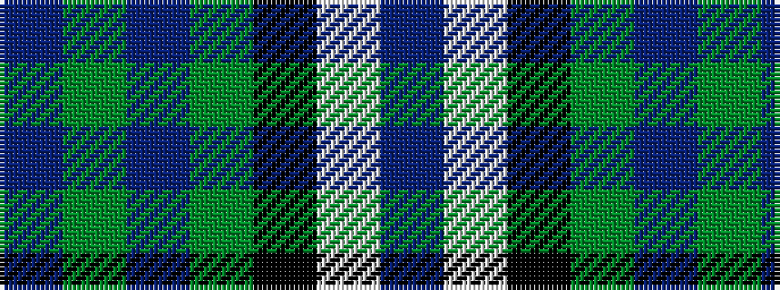

BGBGKWB

It is a 7 stripe tartan.

<figure class="pat-woven">

<figcaption>idealised sample</figcaption>
</figure>

## Colour Sequence



## Tartans with this colour sequence

| Tartans |
|---------------|
| [MacRobart Dress (Personal)](/setts/s7/db8w33k15dg17t3dg17t3~x2/)|
||
| [MacRobart, dress](/setts/s7/db8w33k15g17t3g17t3~x2/)|
||
