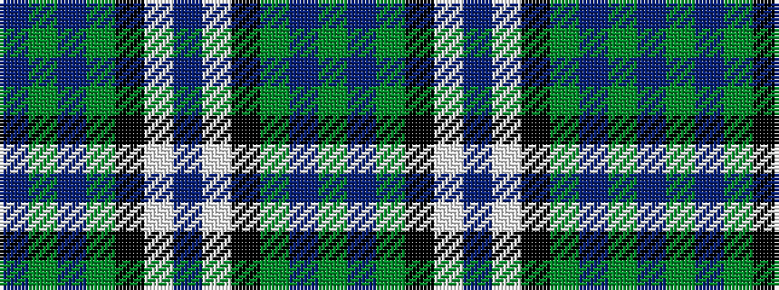

BGBGKWBWKGBG

It is a 12 stripe tartan.

<figure class="pat-woven">

<figcaption>idealised sample</figcaption>
</figure>

## Colour Sequence



## Tartans with this colour sequence

| Tartans |
|---------------|
| [MacRobart Family Tartan](/variants/s12/dg17t3dg17k15w33db8w33k15dg17t3dg17t3~x2/)|
||
