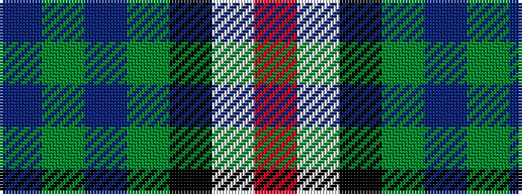

BGBGKWR

It is a 7 stripe tartan.

<figure class="pat-woven">

<figcaption>idealised sample</figcaption>
</figure>

## Colour Sequence



## Tartans with this colour sequence

| Tartans |
|---------------|
| [Nowell/Noel](/setts/s7/db8g2db10g12k1lb1r1~x4/)|
||
| [Nowell/Noel (Name)](/setts/s7/db3g4db20g24k2lb3r1~x2/)|
||
