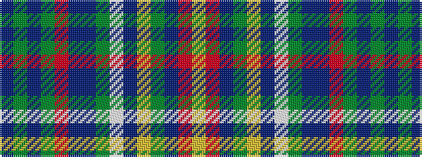

BGBGRBBGWBYGBRY

It is a 15 stripe tartan.

<figure class="pat-woven">

<figcaption>idealised sample</figcaption>
</figure>

## Colour Sequence



## Tartans with this colour sequence

| Tartans |
|---------------|
| [Haliburton, Highlands of...](/variants/s15/t3g1t1g5r2dr4t3g2w1t1ly1g1dr2r2ly1~x4/)|
||
| [Highlands of Haliburton (District)](/variants/s15/t3g1t1g5r2do4t3g2w1t1ly1g1do2r2ly1~x4/)|
||
