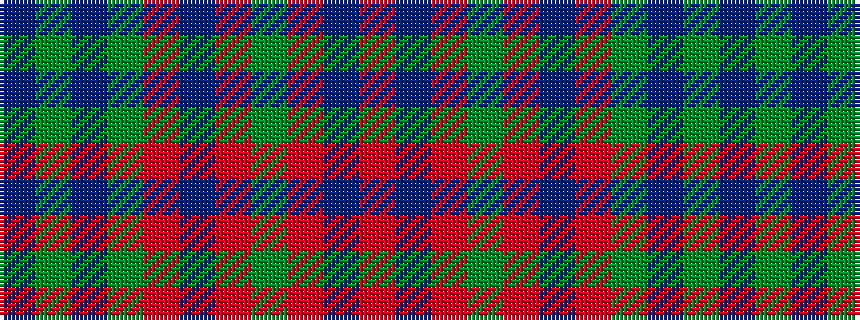

BGBGRBRGRBR

It is a 11 stripe tartan.

<figure class="pat-woven">

<figcaption>idealised sample</figcaption>
</figure>

## Colour Sequence



## Tartans with this colour sequence

| Tartans |
|---------------|
| [Hueg (Munich) Hunting (Personal)](/setts/s11/r10do10r4dg2r2do2r4dg12dp12dg3dp4~x2/)|
||
