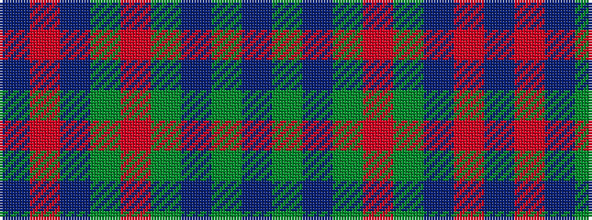

BGBGRGBRB

It is a 9 stripe tartan.

<figure class="pat-woven">

<figcaption>idealised sample</figcaption>
</figure>

## Colour Sequence



## Tartans with this colour sequence

| Tartans |
|---------------|
| [Hubbard (2016)](/setts/s9/dt5r19dt2y8r3y18dt2y9dt2~x2/)|
||
