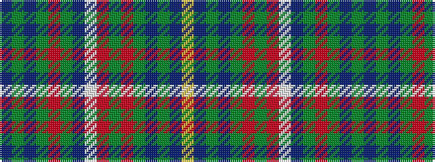

BGBGRGBWRGRGBGBY

It is a 16 stripe tartan.

<figure class="pat-woven">

<figcaption>idealised sample</figcaption>
</figure>

## Colour Sequence



## Tartans with this colour sequence

| Tartans |
|---------------|
| [Wallenberg, Nicolas (Personal)](/setts/s16/db4dg2dp12dg4r1dg28db3w3r3dg48r1dg4dp12dg2db4ly2~x2/)|
||
