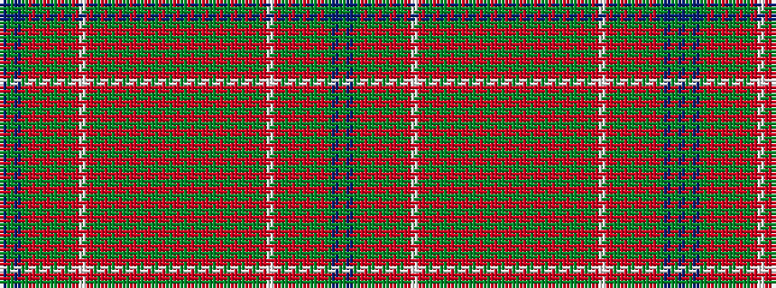

BGBGRGRGRGRWRGRGRGRGRGRGRGRGRGRGRGRGRWRGRGRGRGBG

It is a 48 stripe tartan.

<figure class="pat-woven">

<figcaption>idealised sample</figcaption>
</figure>

## Colour Sequence



## Tartans with this colour sequence

| Tartans |
|---------------|
| [Unidentified Cant #11](/setts/s48/m99g6m8g4m10dy34r2dy6r4dy4r6dy2r7w3r7dy2r6dy4r4dy6r2dy34t36dy6t18/)|
||
