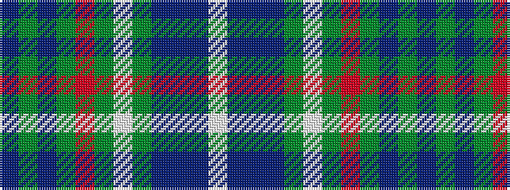

BGBGRGWGBBBW

It is a 12 stripe tartan.

<figure class="pat-woven">

<figcaption>idealised sample</figcaption>
</figure>

## Colour Sequence



## Tartans with this colour sequence

| Tartans |
|---------------|
| [Diana Hunting, Lady](/setts/s12/doi22g2doi4gi1r1gi1lb1gi6dt3do1dt2lb1~x4/)|
||
